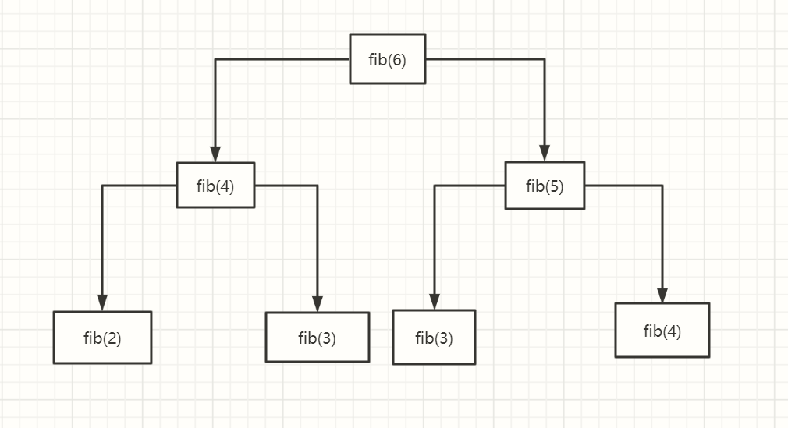

# c 语言讲座第三讲: 简单算法

## 什么是算法

顾名思义, 计算的方法.  
就好像你做题目, 有的解法就是比较巧妙, 会节省你很多做题的时间  
编程也是类似, 同样的问题, 有的运算会很快, 有的很慢.  
你现在写的程序小, 而计算机运算速度又快, 可能感受不到, 但是以后无论是网页开发还是人工智能还是游戏编程还是计算机的各个行业, 其实都离不开优秀的**算法**, 有时候一点点算法的改进就能节约无数的成本

## 来几个所谓的算法看看?

### 简单的查找算法

你能猜到我的生日吗

如果加一个规则, 每次你猜错了我都会告诉你你猜早了还是晚了呢?

你可以硬猜, 运气好猜一次, 运气不好猜365次, 平均下来, 要猜180多次

但是你也可以有技巧的猜: 用**二分法**, 只用猜 9 次!

这里用到的就是二分法, 用c语言实现就是:

```cpp
#include <stdio.h>

int main(void) {
    int birthday = 31 + 30 + 31 + 21;
    int count = 0;

    int DAYS_OF_A_YEAR = 365;
    int i_guess;

    int begin = 1;
    int end = DAYS_OF_A_YEAR;

    while (begin != end && i_guess != birthday) {
        i_guess = (begin + end) / 2;

        if (i_guess > birthday) {
            end = i_guess;
        } else {
            begin = i_guess;
        }
        count++;
    }

    printf("count is: %d\n", count);

    return 0;
}
```

一般来讲, 如果你要在 n 个**按大小排列好的**数里找到某个数, 盲目查找平均要$\frac{n}{2}$次, 而用二分法只用$log_2 n$次, 当 n 很大的时候, 这个差距就相当离谱了  
这就是算法带来的差距

你可能觉得, 这不是小学奥数题吗, 不是有手就行?

好, 那我们来个复杂点的👇

### 简单的排序算法

现在给你 7 个数字, 怎么把他按从小到大的顺序排好呢? 比如说 $[1, 7, 2, 6, 3, 5, 4]$, 你说这不是一眼就看出来, 1234567吗?

那假如是 700个, 7w 个数呢? 你可能就必须用程序来实现了吧

现在, 你就是电脑, 你不能一眼看出这些数的顺序, 你只知道**一共有多少个数**, 并且能够进行简单的四则运算, 大小比较, 声明变量, 怎么把他们排列好呢?

#### 选择排序

一个思路是:

1. 先选出当前列表最小的元素(怎么选?)
2. 把他和第一个元素互换(怎么互换?)
3. 接下来就是要把剩下的元素排列好了! 回到第一步, 即找到剩下元素中最小的一个. 循环执行123步, 直到所有元素都排列好就行了!

c语言代码实现如下:

```cpp
#include <stdio.h>

#define COUNT 10

int main(void) {
    int list[COUNT];
    int i, j, minIndex, temp, min;

    printf("请输入数字： \n");
    for (i = 0; i < COUNT; i++)
        scanf("%d", &list[i]);

    for (i = 0; i < COUNT; i++) {
        min = list[i];
        minIndex = i;
        for (j = i; j < COUNT; j++) {
            if (list[j] < min) {
                min = list[j];
                minIndex = j;
            }
        }
        temp = list[minIndex];
        list[minIndex] = list[i];
        list[i] = temp;
    }

    printf("排序后:\n");
    for (i = 0; i < COUNT; i++)
        printf("%d ", list[i]);
    printf("\n");
}
```

这个方法要计算多少次呢? 每次都得找到当前列表最小的数, 第一次要找$n$次, 第二次要找$n-1$次, 第三次是$n-2$...依次类推, 总共加起来就是$\frac{n\cdot(n-1)}{2}$

#### 归并排序(高难预警)

排序问题还有以下思路:  
首先, 如果数组很小, 比如说只有一两个数, 我不是可以直接把他排好吗?  
我可以把原来的大数组拆成一个个很小的数组, 这不就很容易把他们拍好了吗!  
等等, 拆成小数组倒是简单, 给小数组排序也简单, 但是我怎么把小数组合并回去呢?  

假设要合并的两个数组是 a 和 b , 注意这里的数组是排序好的, 所以合并好的新数组最小的一个一定是 a 的第一个元素或者 b 的第一个!  我只要比比他俩的大小就知道到底是谁了.  
好, 假如说我发现 a 的第一个数更小, 我们就可以把他拿出来放到合并好的数组里了!  
现在剩下的就是把 拿走了第一个元素的 a 和 b 合并, 欸, 有没有发现第二小的元素肯定是 现在的 a 的第一个元素或者 b 的第一个元素? 是不是发现了一个循环? 只要**不断地比较 ab 数组的第一个元素, 拿出较小的放到新数组里, 直到 ab 里的元素都被拿光**, 不就把二者合并了吗!

这就是**分治**的思想, 大问题化成小问题, 再把小问题的解合并!

想想具体怎么操作:  
首先我们已经会合并数组了, 把现在要排序的数组分成左右两边, 并且假设他们已经被排序好了(先别管怎么排序好的, 反正就是排好了), 只需要把他俩合并就可以得到完整的排序好的数组了  
好, 那么怎么得到左右两边的排序好的数组呢? 只用把左边分成左右两边, 把他们拍好, 再合并, 左边就排好了, 右边同理. 怎么把左边的左边排好呢? 只用把他分成左右....  
是不是从前有座山, 山里有座庙的感觉, 没错, 这个就叫**递归**  
好, 那么总不能无限的分下去吧, 什么时候是个头?  
当数组只剩一个数了, 是不是就不用排序了? 你每分一次, 数组长度就除以2, 如果说原来的大数组一共有 n 个数, 平均来说分$log_2 n$次就可以分到头

那么这个算法**计算量有多大**呢? 我们这么来看:  
首先, 合并数组的计算量是多大? 每比较一次, 就拿出来一个数, 所以两个数组一共有几个数就要比几次吧. 第一次划分, 一共两个数组, 合并需要比较 n 次, 第二次划分, 一共 4 个数组, 两两合并, 每次合并各比较$\frac{n}{2}$次, 但是一共合并了两次, 所以合并第二次划分的所有数组的总计算量还是 n, 往后的划分同理, **虽然每次单个合并的计算量越来越小, 但是要合并的次数越来越多, 抵消之下, 每次合并都会计算 n 次!**  
那么一共要合并多少次呢? 其实刚才已经算过了, 合并$log_2 n$次就够了!  
所以总体的计算量是$n\cdot log_2n$  
还记得选择排序的计算量有多大吗? 是$\frac{n\cdot(n-1)}{2}$哦, 想想看, 当 n 相当大的时候(比如说对所有高考考生的成绩进行排序, 1kw人), 两者的效率差了多少!

顺便贴一下C语言代码:

```cpp
#include <stdio.h>
#define COUNT 10

void merging(int* list_left,
             int list_left_size,
             int* list_right,
             int list_right_size) {
    int i, j, k, m;
    int temp[COUNT];

    i = j = k = 0;

    while (i < list_left_size && j < list_right_size) {
        if (list_left[i] < list_right[j]) {
            temp[k] = list_left[i];
            k++;
            i++;
        } else {
            temp[k++] = list_right[j++];
        }
    }

    while (i < list_left_size) {
        temp[k++] = list_left[i++];
    }

    while (j < list_right_size) {
        temp[k++] = list_right[j++];
    }

    for (m = 0; m < (list_left_size + list_right_size); m++) {
        list_left[m] = temp[m];
    }
}

void MergeSort(int k[], int n) {
    if (n > 1) {
        int* list_left = k;
        int list_left_size = n / 2;
        int* list_right = k + list_left_size;
        int list_right_size = n - list_left_size;

        MergeSort(list_left, list_left_size);
        MergeSort(list_right, list_right_size);

        merging(list_left, list_left_size, list_right, list_right_size);
    }
}

int main() {
    int i, list[COUNT] = {5, 2, 6, 0, 3, 9, 1, 7, 4, 8};

    MergeSort(list, COUNT);

    printf("排序后的结果是：");

    for (i = 0; i < COUNT; i++) {
        printf("%d ", list[i]);
    }

    return 0;
}
```

#### 其他排序算法

其实排序算法有相当多种类, 按大类分都有十几种, 每种都有很多的变体, 感兴趣的可以看看这个B站视频: [6分钟演示15种排序算法](https://www.bilibili.com/video/BV1Ws411f7aJ?from=search&seid=7024002180256938579)(想看归并排序的可视化可以空降1分05秒)

### 再谈递归: 斐波那契数列求和

兔子数列想必大家都听说过, 如何用代码求出第 n 项呢?

第 n 项 = 第 n-1 项+第 n-2 项, 我们只用求出这两项就好了, 那么怎么求这两项呢? 只要求第 n-2, n-3, n-4项, 怎么求他们呢? 只用...  
好家伙, 这不就是递归吗!

```cpp
#include <stdio.h>

int fib(int n) {
    if (n <= 2)
        return 1;
    return fib(n - 1) + fib(n - 2);
}

int main() {
    int n = 10;
    for (int i = 0; i < n; i++) {
        printf("fib %d is: %d\n", i + 1, fib(i + 1));
    }

    return 0;
}
```

这个函数写起来只有 3 行! 甚至还可以更短, 1 行!

```cpp
int fib(int n) {
    return n<=2 ? 1 : fib(n - 1) + fib(n - 2);
}
```

短是短, 但是效率怎么样呢? 你算一个`fib(45)`试试? 卡了半天才有结果!

我们看看这个递归是怎么算的:



注意到, 短短的两步递归之内, `fib(4)`就要计算 2 次, `fib(3)`更是要算 3 次以上, fib(2)就更不提了, 这个计算量是树形增长的, 事实上, 是指数递增的!